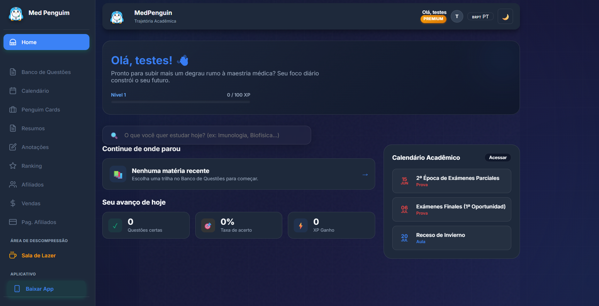
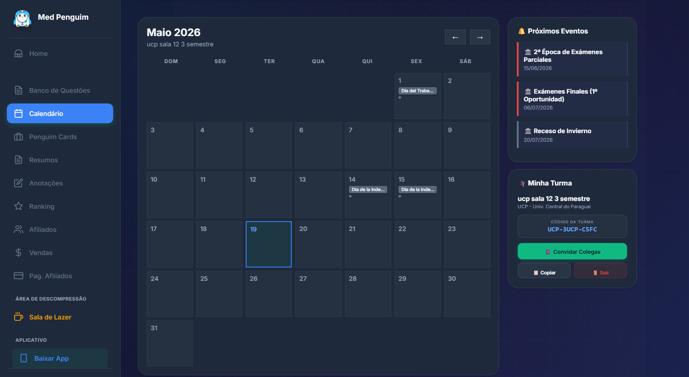
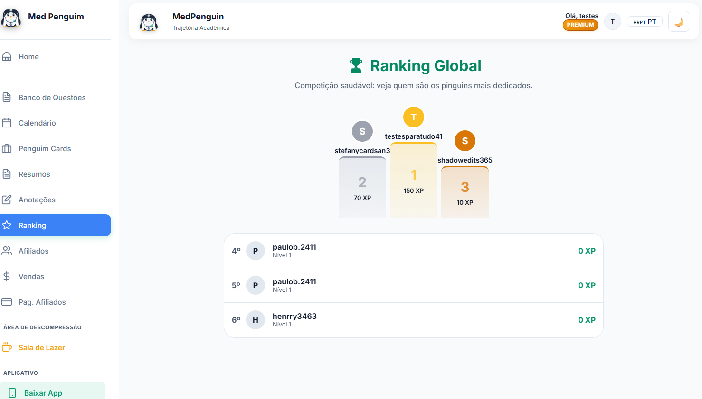
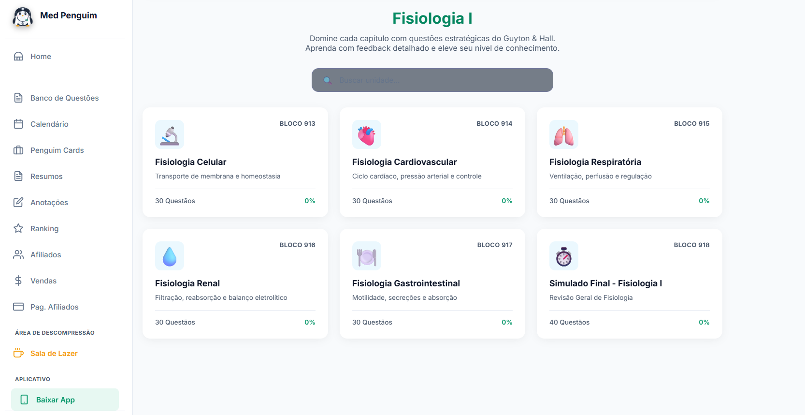
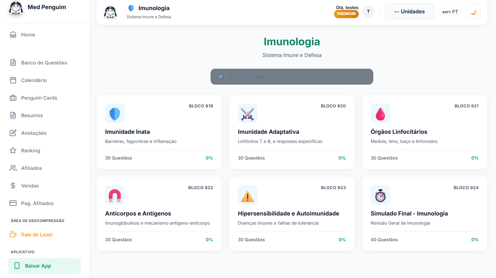
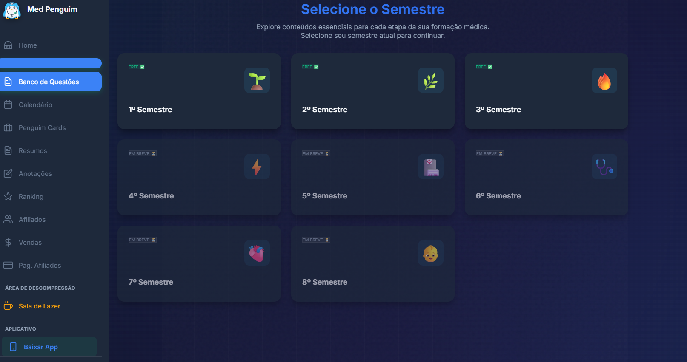

# 🐧 MedPenguin - Medical Education Platform

## MedPenguin

MedPenguin is a modern AI-assisted educational platform designed to help medical students improve productivity, retention, and learning performance through gamified and interactive study experiences.

The platform combines active learning tools such as question banks, flashcards, summaries, progress tracking, rankings, and academic scheduling into a unified digital ecosystem focused on engagement and long-term learning efficiency.

This public repository was sanitized and prepared specifically for portfolio, recruiter evaluation, and educational demonstration purposes. Critical infrastructure files, payment systems, private webhooks, and production secrets were intentionally removed to ensure safe public publication.

---

# 🚀 Main Features

## 📚 Intelligent Question Bank

* Structured medical subjects organized by semesters and disciplines
* Immediate pedagogical feedback and detailed explanations
* Progress tracking and performance monitoring

## 🎴 Flashcards System

* Active recall and spaced repetition study system
* Organized by medical specialties and study topics
* Optimized for fast and efficient review sessions

## 📝 Notes & Study Summaries

* Integrated academic summaries and study materials
* Personal note-taking module directly inside the platform

## 📅 Academic Calendar

* Interactive academic scheduling system
* Pre-configured university calendars and event tracking

## 🏆 Gamification & Ranking

* XP progression system and dynamic leveling
* Global leaderboard for community engagement and motivation

## ☕ Relax & Focus Area

* Built-in leisure and relaxation features
* Designed to reduce burnout during intensive study sessions

---

# 🛠️ Tech Stack & Architecture

## Frontend

* HTML5
* CSS3
* Vanilla JavaScript
* Responsive Mobile-First Design
* Progressive Web App (PWA)

## Backend & Integrations

* Netlify Functions (Serverless APIs)
* Supabase (PostgreSQL Database & Authentication)
* OAuth Authentication
* Real-time database interactions

---

# 🔒 Security & GitHub Sanitization

To safely publish this repository publicly:

* Production secrets were removed
* Stripe and MercadoPago private integrations were excluded
* Sensitive webhooks and server-side infrastructure were removed
* Supabase production credentials were replaced with placeholders
* Temporary and internal development files were deleted

This repository is intended exclusively for portfolio and educational demonstration purposes.

---

# ⚙️ Local Installation

## Requirements

* Modern web browser
* Local development server
* Optional: Netlify CLI for serverless functions

## Setup

Clone the repository:

```bash
git clone https://github.com/your-username/medpenguin-platform.git
cd medpenguin-platform
```

Configure your Supabase credentials inside `config.js`:

```js
const MEDPENGUIN_CONFIG = {
  supabaseUrl: 'YOUR_SUPABASE_URL',
  supabaseKey: 'YOUR_SUPABASE_PUBLISHABLE_KEY',
  siteUrl: window.location.origin
};
```

Start a local server and run the project.

---

# 📸 Screenshots

## Landing Page


## Dashboard



## Academic Calendar



## Ranking System



## Study Materials



## Additional Study Materials



## Rest & Relax Area


## Semester Dashboard



---

# 📄 License

This repository is publicly available exclusively for portfolio and professional showcase purposes.

All branding, educational content, and platform identity remain property of the original creator.
